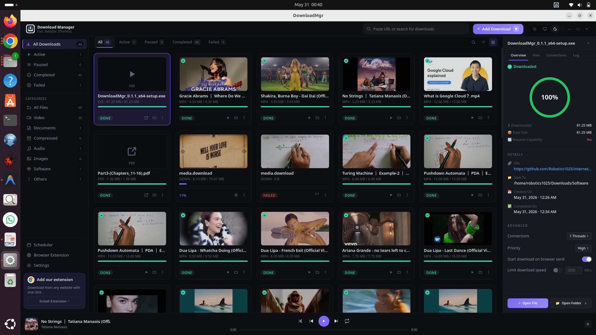
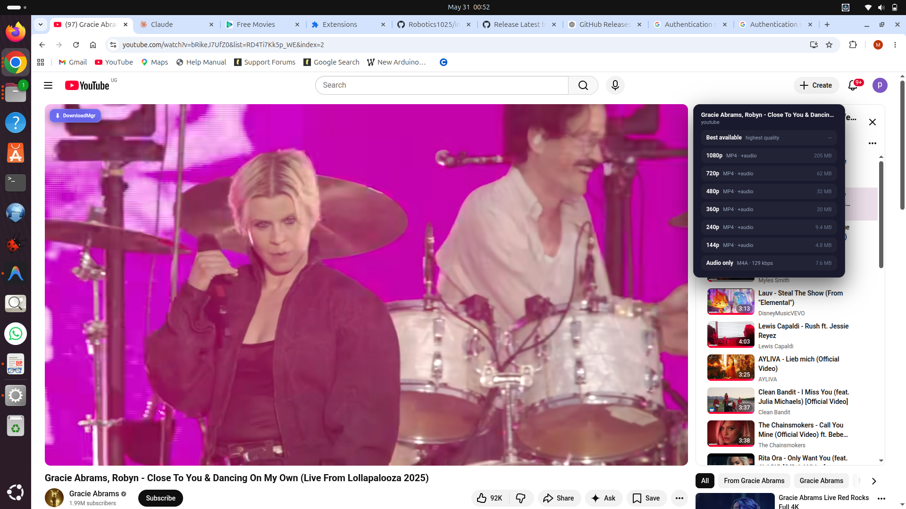
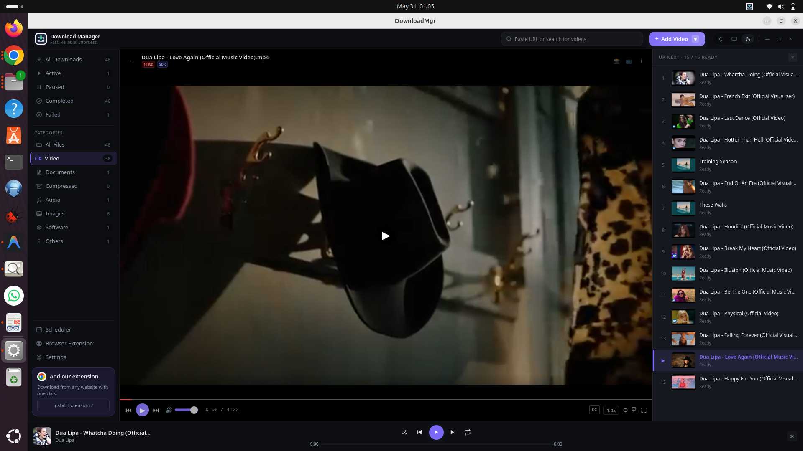
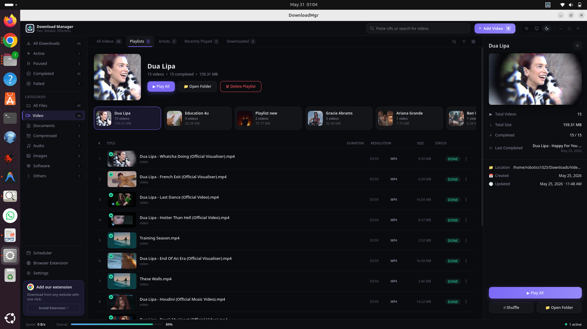

<div align="center">


# DownloadMgr

**A local-first desktop download manager with a browser companion.**

Pro-tool UI, real video extraction, no cloud, no telemetry.

[](https://github.com/Robotics1025/internet-downloader/actions/workflows/build-linux.yml)
[](https://github.com/Robotics1025/internet-downloader/actions/workflows/build-windows.yml)
[](https://github.com/Robotics1025/internet-downloader/releases)

</div>

---

## What it is

A native desktop app for queuing, organising, and downloading video / audio / files from anywhere on the web — paired with a Chrome extension that captures streams from sites yt-dlp can't extract on its own. Everything runs **on your machine**: no remote API, no account, no telemetry, no upload of URLs or metadata. The only network calls are to the sites you're downloading from.

## Highlights

- **YouTube, Vimeo, TikTok, Twitch, Dailymotion, 1000+ more sites** via embedded yt-dlp.
- **Browser extension** intercepts HLS / DASH manifests on sites yt-dlp doesn't natively support — works on most streaming sites that aren't DRM-protected.
- **Playlist auto-grouping** by uploader, plus rename, move-between, and delete.
- **Bundled ffmpeg** for merging high-quality video + audio formats — no system install needed.
- **Built-in player** for completed downloads (audio + video), with a Spotify-style mini-player that persists across navigation.
- **Settings UI** for download directory, max parallel, default quality, theme (light / dark / system), auto-start toggle.
- **Tray icon, native notifications, single-instance lock** — close to tray, native "download complete" toast, second launch focuses the existing window.
- **Five installer formats** built automatically on every push: `.AppImage`, `.deb`, `.rpm` for Linux; `.msi` and `.exe` for Windows.

## Download

Grab the build for your OS from the [**Releases page**](https://github.com/Robotics1025/internet-downloader/releases).

| OS | File | Install |
|---|---|---|
| **Linux (any modern distro)** | `DownloadMgr_*.AppImage` | `chmod +x DownloadMgr_*.AppImage && ./DownloadMgr_*.AppImage` |
| **Ubuntu / Debian / Mint / Pop!_OS** | `download-mgr_*.deb` | `sudo apt install ./download-mgr_*.deb` |
| **Fedora / RHEL / openSUSE** | `download-mgr-*.rpm` | `sudo dnf install ./download-mgr-*.rpm` |
| **Windows 10 / 11** | `DownloadMgr_*_x64-setup.exe` *or* `DownloadMgr_*_x64_en-US.msi` | Double-click; the installer asks for the install location |
| **macOS** | *Coming soon* — CI workflow in progress | — |

> **First-run security warning:** The installers are not yet code-signed. On Windows click **More info → Run anyway** on the SmartScreen prompt; on macOS right-click the `.dmg` → **Open**. One-time per machine. Code signing is planned for v1.0.

## Browser extension

The extension lets you send any video / file URL straight to DownloadMgr from your browser's toolbar, right-click menu, or a floating button that appears over video elements.

**Install (developer / unpacked):**
1. Open `chrome://extensions`.
2. Toggle **Developer mode** (top right).
3. Click **Load unpacked** → select the `apps/browser-extension/` directory in this repo.
4. Pin the **DownloadMgr Bridge** extension to your toolbar.

The extension auto-discovers the API's port (default 6543; falls back to scanning if busy) and persists the last-known port across browser restarts.

## Screenshots

> Place your screenshots in `docs/screenshots/` and the references below will resolve automatically.

| Main window | Playlist view |
|---|---|
|  |  |

| Built-in player | Browser extension quality picker |
|---|---|
|  |  |

| Settings | Extension installed in Chrome |
|---|---|
|  |  |

## Architecture

```
┌──────────────────────────────────────────────────────────────┐
│  Tauri 2 shell (Rust) — single signed .exe / .AppImage       │
│                                                              │
│  ┌────────────────────┐    ┌─────────────────────────────┐   │
│  │  WebView           │    │  Sidecar process            │   │
│  │  React 19 + TS +   │◄──►│  dm-api (PyInstaller bundle)│   │
│  │  Tailwind v4       │    │  ├─ FastAPI + uvicorn       │   │
│  │  (apps/desktop)    │    │  ├─ yt-dlp (binary)         │   │
│  └────────────────────┘    │  ├─ ffmpeg (binary)         │   │
│         ▲                  │  └─ SQLite + Alembic        │   │
│         │ http://127.0.0.1:6543 (auto-discovered)            │
│         │ ws://127.0.0.1:6543/api/ws/progress                │
│         │                                                    │
│  ┌──────────────────────────────────────────────────────┐    │
│  │ Tray · Notifications · Single-instance · Auto-update │    │
│  └──────────────────────────────────────────────────────┘    │
└──────────────────────────────────────────────────────────────┘
                       ▲
                       │  HTTP
              ┌────────────────────┐
              │  Browser extension │  (Manifest V3, Chrome / Edge / Brave)
              │  · Hover button    │
              │  · Stream capture  │
              │  · Right-click menu│
              └────────────────────┘
```

### Backend layers (Clean / Hexagonal)

```
apps/api/src/dm_api/
├── domain/               # Pure business model (no I/O, no frameworks)
│   ├── entities/         #   DownloadTask, Segment, Queue
│   ├── value_objects/    #   DownloadStatus, SegmentStatus, QueueStatus
│   ├── events/           #   DomainEvent + concrete events
│   └── policies/         #   Retry, segmentation, checksum, speed-limit
├── application/          # Use cases + ports (interfaces)
│   ├── use_cases/        #   AddDownload, StartDownload, ListDownloads
│   ├── ports/            #   DownloadRepository, SettingsRepository, ...
│   └── services/         #   DownloadRunner, ProgressService
├── infrastructure/       # Adapters (implement the ports)
│   ├── persistence/      #   SQLite repos, Alembic migrations
│   ├── media/            #   yt-dlp probe + worker, binary discovery
│   ├── http/             #   httpx-based metadata probe
│   └── logging/          #   JSON structured logs, rotating file handler
└── presentation/         # FastAPI routers + DTOs (entry point)
    ├── routers/          #   /api/downloads, /api/settings, /api/media, ...
    ├── websocket/        #   /api/ws/progress
    └── schemas/          #   Pydantic DTOs
```

Dependency rule: `presentation → application → domain ← infrastructure`. The domain knows nothing about FastAPI, SQLAlchemy, or yt-dlp; ports + adapters keep it that way. Enforced by `tests/unit/application/test_dependency_rule.py`.

## Tech stack

**Desktop shell:** Tauri 2.x (Rust 1.96, edition 2021), `tauri-plugin-single-instance`, `tauri-plugin-notification`, `tauri-plugin-shell`.

**Frontend:** React 19, TypeScript 5, Tailwind CSS v4, Vite 8, lucide-react icons. Design tokens system under `apps/desktop/src/design/`.

**Backend:** Python 3.14, FastAPI 0.110+, uvicorn, SQLAlchemy 2 async, aiosqlite, Alembic, httpx, yt-dlp (nightly, vendored).

**Browser extension:** Manifest V3, vanilla JS service worker + content scripts, page-level fetch / XHR interceptor for HLS / DASH capture.

**Testing:** pytest 8 with `asyncio_mode=auto`, 90% coverage gate on domain + application layers, 194 tests at last count.

**Bundling:** PyInstaller for the Python sidecar; Tauri's native bundler for AppImage / .deb / .rpm / .msi / .exe; GitHub Actions matrix for CI.

## Build from source

### Prerequisites

- **Linux**: `sudo apt install libwebkit2gtk-4.1-dev libgtk-3-dev libayatana-appindicator3-dev librsvg2-dev libsoup-3.0-dev patchelf gstreamer1.0-plugins-bad gstreamer1.0-pulseaudio`
- **Windows**: Visual Studio 2022 Build Tools with C++ workload
- **macOS**: Xcode Command Line Tools
- All platforms: [Rust](https://rustup.rs), [Node.js 20+](https://nodejs.org), [Python 3.14](https://www.python.org), [uv](https://docs.astral.sh/uv/)

### Steps

```bash
# 1. Clone
git clone https://github.com/Robotics1025/internet-downloader
cd internet-downloader

# 2. Backend deps
cd apps/api && uv sync && cd ../..

# 3. Frontend deps
cd apps/desktop && npm install && cd ../..

# 4. Vendor yt-dlp + ffmpeg (Linux/macOS; on Windows the CI workflow handles this)
./build/pyinstaller/fetch_binaries.sh

# 5. Build the PyInstaller sidecar
cd apps/api && uv run pyinstaller --noconfirm \
  --distpath ../../build/pyinstaller/dist \
  --workpath ../../build/pyinstaller/build \
  ../../build/pyinstaller/dm-api.spec
cd ../..

# 6. Stage the sidecar for Tauri
TRIPLE=$(rustc -vV | grep "host:" | awk '{print $2}')
mkdir -p apps/shell/binaries
cp build/pyinstaller/dist/dm-api apps/shell/binaries/dm-api-$TRIPLE
chmod +x apps/shell/binaries/dm-api-$TRIPLE

# 7. Build the desktop app
cd apps/shell && cargo tauri build
# Output: target/release/bundle/{appimage,deb,rpm,msi,nsis}/...
```

### Dev mode (live-reloaded)

```bash
# Terminal 1: API
cd apps/api && uv run python -m dm_api.presentation.main

# Terminal 2: React with hot reload
cd apps/desktop && npm run dev

# Terminal 3: Tauri shell pointing at Vite
cd apps/shell && cargo tauri dev
```

## Project structure

```
internet-downloader/
├── apps/
│   ├── api/                  Python FastAPI backend (the sidecar)
│   ├── desktop/              React UI served by the Tauri shell
│   ├── shell/                Tauri Rust shell — owns the window
│   └── browser-extension/    Chrome / Edge / Brave MV3 extension
├── build/
│   └── pyinstaller/          Bootstrap, spec, vendored-binary fetcher
├── docs/
│   ├── superpowers/specs/    Approved design docs
│   └── superpowers/plans/    Implementation plans, task-by-task
├── .github/workflows/        CI: build-windows.yml, build-linux.yml
├── run_app.sh                Local launcher with sane env vars
└── README.md
```

## Roadmap

- [x] Plan 1 — API readiness (port discovery, binary discovery, structured logging)
- [x] Plan 2 — Linux AppImage MVP
- [x] Plan 3 — UI polish + production shell features (tray, notifications, single-instance)
- [x] Plan 4 — Settings UI + REST endpoint
- [x] Windows CI — `.msi` + `.exe` installers on every push
- [x] Linux CI — `.AppImage` + `.deb` + `.rpm` on every push
- [ ] macOS CI — `.dmg` for Intel + Apple Silicon
- [ ] Plan 5 — auto-updater via `tauri-plugin-updater` + signed update manifests
- [ ] Opt-in Sentry crash reporting
- [ ] Code signing (Windows Authenticode + Apple notarization)
- [ ] Chrome Web Store submission for the browser extension

## Contributing

PRs welcome. The codebase follows strict layer separation and TDD — see `SYSTEM_DESIGN.md` for the architecture rules and `SKILL.md` for the development workflow.

Before pushing:

```bash
cd apps/api && uv run pytest -q           # 194 tests, 90% coverage gate
cd apps/desktop && npx tsc -b             # Type-check
```

## License

MIT. See [LICENSE](LICENSE).

No telemetry, no cloud sync, no remote management. Your downloads, your machine.

---

<div align="center">

Made with ❤️ for people who'd rather their downloads not be SaaS.

[Report a bug](https://github.com/Robotics1025/internet-downloader/issues) · [Request a feature](https://github.com/Robotics1025/internet-downloader/issues) · [Releases](https://github.com/Robotics1025/internet-downloader/releases)

</div>
